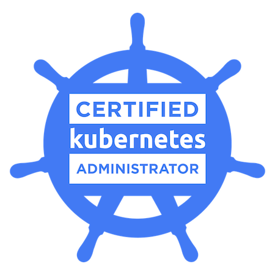
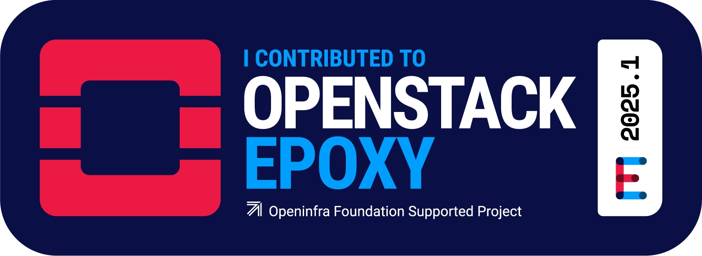

 

### Hi there 👋

## 👀 Who am I
📛 **Junwoo Park**  
🎓 **Graduated from Sahmyook University**, majoring in **Computer Science & Engineering** ( 2018.03 ~ 2025.02 ) 

## 🌱 Interests
☁️ Cloud Infrastructure & Engineering 
🚉 Platform Engineering 
🔧 DevOps & Automation 

 

 

<!--

 

</a>
</a>
</a>
</a>

</a>
</a>
</a>
</a>

 </a>
</a>
</a>
-->

### 🏢 Careers

| Company          | Job Role                               | Description                                                          | Period              |
| ---------------- | -------------------------------------- | -------------------------------------------------------------------- | ------------------- |
| iCloud Co., Ltd. | Cloud Infra Engineer (Intern) | Assisted in designing and automating   cloud infrastructure operations | 2024.03–2024.06 |

 

### 📚 What I do/did

| Club                                | Club Desc.                          | Role               | Role Desc.                                                  | Period             |
| ----------------------------------- | ----------------------------------- | ------------------ | ----------------------------------------------------------- | ------------------ |
| **KOSA Cloud Engineering Bootcamp** | Bootcamp                            | Cloud Member       | Cloud Infrastructure & Automation                           | 2024.12 \~ 2025.02 |
| **Sahmyook Univ. IACF**             | Industry-Academic Project           | Project Leader     | MSP Ops Automation Web Dev (FastAPI, React, GitHub Actions) | 2024.08 \~ 2024.11 |
| **OSSCA**                           | Open Source SW Contribution Academy | OpenStack - Mentee | OpenStackSDK Contribution                                   | 2024.07 \~ 2024.11 |
| **Kakao Enterprise**                | Cloud Curriculum Development        | Course Developer   | Cloud Edu. Scenario Dev (Cloud Basic & K8s), Assistant      | 2023.09 \~ 2024.01 |
| **CLOUD-LAB**                       | University Club                     | Club Leader        | Cloud Infra Edu & Internal VM Service Planning              | 2023.09 \~ 2024.02 |

 
 
### 🍀 Scholarship
| Scholarship           | When      | Where               |
| --------------------- | --------- | ------------------- |
| Ranked 1st in Department | Fall 2023 | Sahmyook University |

 

### 🏆 Prizes
| Contest                                            | Prize                          | When    | Where                               |
| -------------------------------------------------- | ------------------------------ | ------- | ----------------------------------- |
| Cloud Infrastructure Project Competition | 🥇 Grand Prize   (Chairman’s Award) | 2025.02 | KOSA (Korea Software Industry Association) |

 

### 🏆 Certifications

<!--

-->

 

### 🗃️ Open Source Contributions
🙌🏻 believe in the power of Open Source
| Open Source | Contribution | 
| ------------ | ------------- | 
| 🖍️ OpenstackSDK | [Provides Designate System Service Status](https://review.opendev.org/c/openstack/openstacksdk/+/927854) | 

<!--  -->

 

<!--
**NOOJU/NOOJU** is a ✨ _special_ ✨ repository because its `README.md` (this file) appears on your GitHub profile.

Here are some ideas to get you started:

- 🔭 I’m currently working on ...
- 🌱 I’m currently learning ...
- 👯 I’m looking to collaborate on ...
- 🤔 I’m looking for help with ...
- 💬 Ask me about ...
- 📫 How to reach me: ...
- 😄 Pronouns: ...
- ⚡ Fun fact: ...
-->
